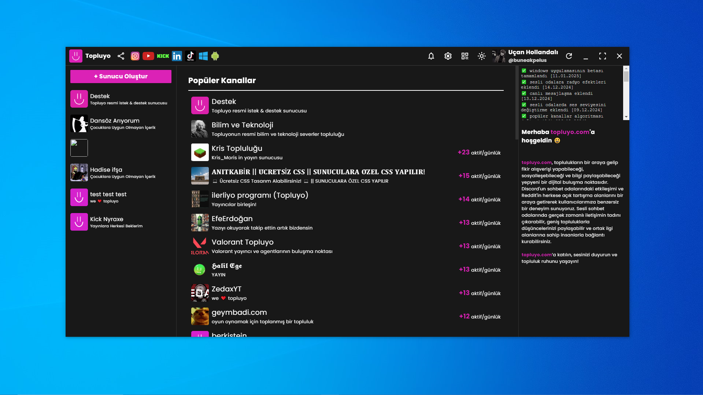

# Topluyo Windows Uygulaması

**Topluyo Windows Uygulaması**, Topluyo platformunun tüm özelliklerini Windows işletim sisteminde sorunsuz bir şekilde kullanmanızı sağlayan resmi masaüstü uygulamasıdır.

## Özellikler

- **Kullanıcı Dostu Arayüz**: Modern ve sezgisel tasarım sayesinde kolay kullanım.
- **Gerçek Zamanlı Bildirimler**: Önemli güncellemelerden anında haberdar olun.
- **Otomatik Güncellemeler**: Yeni özellikler ve iyileştirmeler otomatik olarak uygulanır.

## Kurulum

1. **İndir**: [Son sürümü indirin](https://github.com/topluyo/windows-app-exe/archive/refs/heads/main.zip).
2. **Çalıştır**: İndirilen `Topluyo Setup 2025.1.1-1.2035.exe` dosyasını açın.
3. **Yükleme**: Ekrandaki talimatları izleyerek kurulumu tamamlayın.

## Kullanım

- **Giriş Yapın**: Mevcut Topluyo hesabınızla giriş yapın veya yeni bir hesap oluşturun.
- **Keşfedin**: Uygulamanın sunduğu tüm özellikleri menü üzerinden keşfedin.
- **Ayarlar**: Tercihlerinize göre uygulama ayarlarını düzenleyin.

## Geri Bildirim ve Katkı

Geri bildirimleriniz bizim için değerlidir. Lütfen öneri ve sorunlarınızı [issue tracker](https://github.com/topluyo/windows-app/issues) üzerinden paylaşın.

## Lisans

Bu proje [MIT Lisansı](LICENSE) ile lisanslanmıştır.
